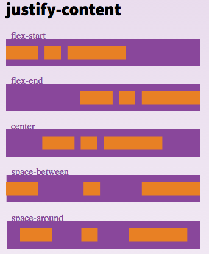

## Flex in React Native

In React Native, `flex` is a property used within the Flexbox layout system to create responsive and adaptive layouts. It defines how a component should grow relative to its siblings.

### Flex Properties

1. **`flexDirection`**: Defines the primary axis direction (row or column).
2. **`justifyContent`**: Aligns children along the primary axis.
3. **`alignItems`**: Aligns children along the cross axis.
4. **`alignContent`**: Aligns rows of children along the cross axis when there's extra space.
5. **`flexWrap`**: Controls whether children wrap to the next line if they overflow the container.
6. **`alignSelf`**: Allows an individual item to override the alignItems value.
7. **`flex`**: Specifies how a component grows and shrinks.
8. **`flexGrow`**: Specifies the growth factor relative to siblings.
9. **`flexShrink`**: Specifies the shrink factor relative to siblings.
10. **`flexBasis`**: Specifies the initial main size of the component.
11. **`order`**: Specifies the order of the flex items.

For further details, refer to the [React Native Flexbox Documentation](https://reactnative.dev/docs/flexbox).

